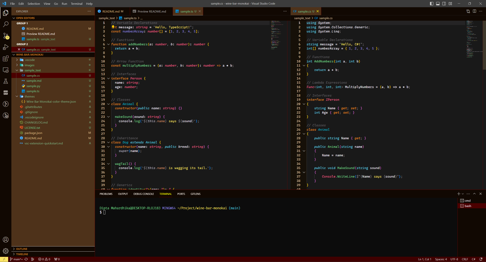
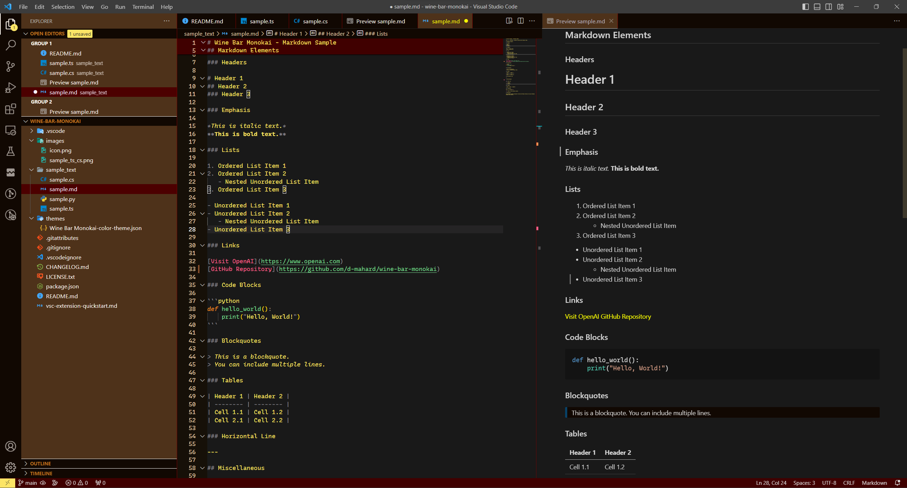
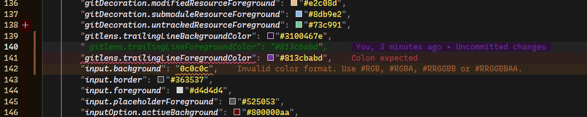

# Wine Bar Monokai - Visual Studio Code Color Theme

**Wine Bar Monokai** is a dark color theme for Visual Studio Code that offers a unique and cozy aesthetic. Inspired by the warm, rustic feel of an old wooden bar serving high-quality red wine, this theme aims to make your coding experience more pleasant and visually appealing. It combines the classic Monokai highlighter with a distinctive brown-maroon color palette, creating a comfortable working environment with clear distinctions between your working area and functional elements of the workbench.

## Features

- **Dark Theme:** a dark color scheme that is easy on the eyes and perfect for long coding sessions

- **Meticulously crafted:** (almost) all color elements are carefully chosen to optimize visual functionality, consistency, and aesthetic

- **Intuitive Workflow:** designed to enhance your workflow by providing clear separation between your working area (editor, terminal) and functional elements like the sidebar

- **Monokai Syntax Highlighter:** incorporates the familiar Monokai syntax highlighting, making your code visually distinct and easy to read

- **Optimized for Languages:** while this theme works well with various programming languages, it is particularly optimized for TypeScript and C#, ensuring a smooth and enjoyable coding experience

- **Extended Colors:** includes customized colors for the following extensions: 
  - GitLens
  - ErrorLens
  - Copilot
  - GitHub PR Extension

## Samples

   
   *Wine Bar Monokai with TypeScript and C# code.*

   
   *Wine Bar Monokai with Markdown text.*

   
   *Carefully chosen colors, even for ghost text.*

## Customize the theme
### Syntax color
If you want to customize the syntax color, follow the instruction [here](https://code.visualstudio.com/api/extension-guides/color-theme). I prepared some code sample of various languages in the repository to help testing the colors.

### Workbench color
Customizing the color of workbench element is a bit more tricky, as there is no straighforward way to find out the name of the element you want to change (if there is, please let me know!). In any case, the instruction is available [here](https://code.visualstudio.com/api/extension-guides/color-theme#workbench-colors).

### Other documentation
For more detailed explanation on VS Code theme color, including how to make your own, please refer to the following documentations:
- [General introduction](https://code.visualstudio.com/api/references/theme-color)
- [Color theme extension](https://code.visualstudio.com/api/extension-guides/color-theme)
- [Syntax highlight](https://code.visualstudio.com/api/language-extensions/syntax-highlight-guide)
- [Semantic highlight](https://code.visualstudio.com/api/language-extensions/semantic-highlight-guide)

## License

Wine Bar Monokai is licensed under the [GNU General Public License v3.0 (GPL-3.0)](COPYING). You are free to use, modify, and distribute this theme under the terms of this open-source license.

Enjoy coding with the cozy and rustic feel of Wine Bar Monokai! If you have any issues or suggestions, please feel free to report them on the [GitHub repository](https://github.com/d-mahard/wine-bar-monokai). Your feedback is greatly appreciated.
